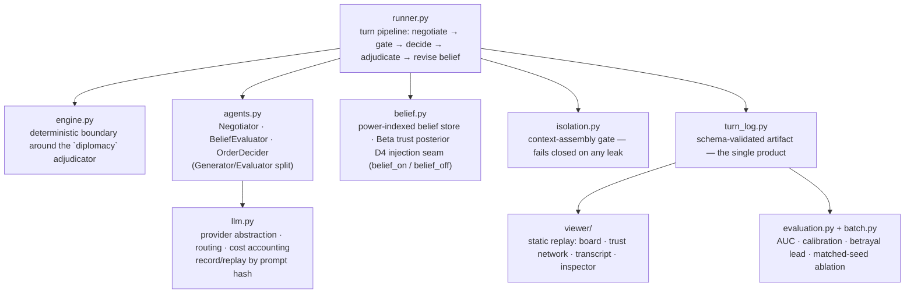

# AI Diplomacy — Theory of Mind engineering

**Live demo: https://pcschmidt.github.io/Diplomacy/** (static replay viewer,
MIT-licensed, CI-deployed on every push to `viewer/`). The engine, belief store, and
eval harness are AGPL and run locally — see [Licence](#licence) for why the repo is
split that way.

## What is this? (plain-language overview)

Seven AI powers play full-rules Diplomacy and negotiate over it. Each power keeps an
explicit, inspectable belief about every other power — a trust score, updated
separately on what a counterpart *says* and on what it actually *does* once orders
resolve. The point of the project is not an AI that plays Diplomacy well; it is
whether belief modelling can be built as **engineering rather than prompting** —
measurable, falsifiable, and honest about the result even when the result is no.

The thing that makes it more than a chatbot wearing a game:

- **Trust is a statistic, not a made-up number.** Every promise is a structured,
  falsifiable claim; after adjudication the engine diffs what was promised against
  what was ordered, and that diff is the evidence a Beta posterior updates on.
  Betrayals weigh double, because Diplomacy trust is asymmetric — alliances take many
  turns to build and one stab to destroy.
- **Isolation is mechanical, not instructed.** A belief store belongs to exactly one
  power and has no method that could admit another power's private channel. A second
  gate re-scans every assembled prompt and fails closed. Both are proven by fixtures
  that must *fail* — a planted leak, a planted secret an evaluator must never see.
- **The evaluator can't be talked into trusting an ally.** The negotiator drafts from
  its own goals and is allowed to be self-serving; a structurally separate evaluator
  scores incoming messages and sees *only* the counterpart's words and public order
  record — never its own side's plans.
- **The eval harness refuses to lie for you.** Metrics are verified against known
  inputs before ever touching a real game, and a run built on constants or an
  unreliable model is flagged `is_evidence: False` rather than reported as a finding.

| | |
| --- | --- |
| Live demo | https://pcschmidt.github.io/Diplomacy/ (static viewer; GitHub Pages via Actions) |
| Engine | `diplomacy` 1.1.2 — the DATC-compliant reference adjudicator, standard 7-power map |
| Powers | all 7 LLM-driven; 42/42 belief dyads exercised in live play |
| Model | `claude-haiku-4.5` via OpenRouter — chosen on measured tool-call reliability, not price |
| Tests | 8 gates, offline and deterministic, no API key needed (`python run_tests.py`) |
| CI | gate matrix across 4 `PYTHONHASHSEED` values + a dedicated cross-process determinism job |
| Definitive result | evaluator AUC **0.497**, 95% CI **[0.453, 0.542]** on n=667 — chance, tightly bounded |
| Honest scope | the ToM claim is **not supported** by this run; see [Results](#results) |

## Architecture at a glance



Where things live:

| Path | What it is |
| --- | --- |
| `diplomacy_tom/engine.py` | The only code that calls the `diplomacy` adjudicator directly; sorts its order-enumeration output, which is nondeterministic across processes otherwise (finding F3) |
| `diplomacy_tom/belief.py` | Power-indexed belief store; `BayesianBeliefStore` and `StubBeliefStore` behind one `BeliefStore` protocol — the D4 ablation seam |
| `diplomacy_tom/isolation.py` | Context-assembly gate; scans every assembled prompt against a registry of private items and fails closed |
| `diplomacy_tom/agents.py` | The three LLM roles and their structured-output contracts; `commitment_pressure` wiring for the evaluator |
| `diplomacy_tom/llm.py` | `Provider` protocol — Anthropic, OpenRouter, Mock, Record, Replay — plus model routing presets and cost accounting |
| `diplomacy_tom/runner.py` | The turn-processing pipeline; emits one schema-validated turn log per game |
| `diplomacy_tom/evaluation.py`, `batch.py` | AUC/Brier/calibration/betrayal-lead metrics; the matched-seed batch runner behind the ablation |
| `schemas/` | JSON Schema for the turn log and the belief store, versioned, validated on write |
| `tests/` | 7 offline gates, each with negative fixtures that must fail, not just positive ones that must pass |
| `viewer/` | MIT-licensed static replay viewer — reads only turn-log JSON, imports no engine code |
| `ARCHITECTURE.md` | Every decision, every finding (F1–F12), the full ablation write-up — the real documentation |

## Quickstart

```bash
git clone https://github.com/PCSchmidt/Diplomacy
cd Diplomacy
python -m venv .venv && .venv/bin/pip install diplomacy jsonschema anthropic

python run_tests.py                     # 8 gates, offline, no API key needed
node viewer/test-viewer.mjs             # viewer data-contract gate

python -c "from diplomacy_tom.runner import run_game; \
           from diplomacy_tom import turn_log as tl; \
           tl.save(run_game(seed=1901, max_phases=14, use_llm=True), \
                   'viewer/data/sample-game.json')"

python -m http.server -d viewer 8000    # open http://localhost:8000
```

That runs on a deterministic mock provider — no API key, no network, no cost. To use
real models, drop `ANTHROPIC_API_KEY` or `OPENROUTER_API_KEY` in a `.env` at the repo
root (see `.env.example`) and pass a routing preset:

```python
from diplomacy_tom.runner import run_game
from diplomacy_tom.llm import OpenRouterProvider

run_game(seed=1901, use_llm=True, routing="haiku", provider=OpenRouterProvider())
```

Run the matched-seed ablation behind the Results below:

```bash
python -m diplomacy_tom.batch --games 12 --max-phases 8 \
  --provider openrouter --routing haiku --workers 6 \
  --out runs/ --report reports/ablation.md
```

## Approach: why it is built this way

- **The turn log is the product, not a byproduct.** The eval harness and the replay
  viewer are two consumers of one artifact. It embeds the adjudicator's own
  saved-game format verbatim rather than translating it, so there is no layer to
  carry bugs between what the engine resolved and what got logged.
- **Everything is seeded and replayable.** LLM calls are recorded and replayed by
  prompt hash, which is what makes the ablation possible at all — both arms must run
  on identical conditions, and a changed prompt is a loud miss, never a silently
  wrong answer.
- **A test double must be able to fail the way production fails.** The mock provider
  returns *legal* orders and belief-sensitive choices, not just schema-valid ones —
  an earlier version that ignored belief state made both ablation arms play
  identical games while looking like a passing test suite (finding F8).
- **Isolation and separation are proven, not asserted.** Every integrity property has
  a fixture designed to fail: a leak that must be caught, a secret the evaluator must
  never see. A gate that has only ever seen clean input proves nothing.
- **Reliability is a correctness requirement here, not a cost preference.** A model
  that fails to emit a tool call means that power silently passes its turn, which
  corrupts the exact game the ablation is measuring — see the model-selection finding
  under Results.
- **Boring, verifiable tooling.** The standard `diplomacy` PyPI library (DATC-compliant,
  same engine lineage as Meta's CICERO) rather than a hand-rolled adjudicator; JSON
  Schema over hand-written validation; stdlib-only `.env` loading rather than a new
  dependency.

## Motivation

Diplomacy is a recognized hard benchmark in the LLM/Theory-of-Mind research space: it
combines natural-language negotiation with deception detection and alliance-tracking,
and — unlike most ToM toy benchmarks — it produces a demoable artifact (a board plus
a negotiation feed) rather than just a score. The goal was to find out whether a
disciplined belief-modelling architecture, held to the same evidentiary standard as a
real eval, actually produces calibrated trust and predictive betrayal signals — and
to report the answer honestly whichever way it came out.

## Results

**The definitive ablation** (12 seeds × 2 arms, 8 phases, all 7 powers LLM-driven,
`claude-haiku-4.5`, ~$25; 10 of 12 seed pairs completed, 2 dropped on a matched-seed
failure — see Limitations) scored **evaluator AUC 0.497, 95% CI [0.453, 0.542]** on
n=667 falsifiable, scored commitments — chance, with the interval tight enough to
rule out any effect larger than about ±0.05. Ranked by predicted truthfulness, kept
promises do not sort above broken ones.

Calibration shows why, and it isn't subtle:

| the evaluator said | it was actually kept |
| --- | --- |
| 15% chance | **80%** of the time |
| 30% chance | 61% of the time |

The evaluator's low-confidence predictions are backwards. **The Theory of Mind claim
is not supported by this run.**

Getting to a *trustworthy* negative took three rounds of fixing the measurement
itself, and those rounds are the actual engineering substance of this repo (full
write-ups in `ARCHITECTURE.md` §15–§19):

- **F3 — cross-process nondeterminism.** The adjudicator's legal-move enumeration
  varies by `PYTHONHASHSEED` across processes, though two runs *inside one process*
  agree — which is exactly how a naive determinism check would have missed it.
  Unfixed, the two ablation arms would not have been playing the same game, and it
  would have surfaced as unreproducible results months later. Now a dedicated CI job.
- **F7 — the isolation gate flagged its own data as a leak.** Two powers sending
  byte-identical short messages ("Agreed.") caused the scan to flag a power's own
  legitimate message as someone else's leak. A gate that cries wolf gets switched
  off, which is worse than the leaks it prevents.
- **F10/F11 — silent fallbacks manufactured evidence.** When a model failed to emit a
  tool call, earlier code substituted a plausible-looking default (`predicted_truthfulness:
  0.5`, or a hold order). In one batch, **47% of "evaluator scores" were that
  constant**, not model output — diluting the measured AUC toward chance by
  construction, independent of whether the belief layer works at all. Fixed by making
  every non-decision explicit in the schema rather than quietly substituting a value
  that looks like a real one.
- **Model selection was not what the price sheet suggested.** A model 10× cheaper on
  paper (`glm-5.3-flash`) failed to emit a tool call on ~60% of decisions and ~75% of
  evaluations; per *successful* call it was measured *more* expensive than
  `claude-haiku-4.5`, because a failure burns the full token budget and then triggers
  a retry. Benchmark leaderboard rank did not predict tool-call reliability on this
  specific structured task.
- **Ground truth was invalid before it was wrong.** The first batch's 82% "kept" base
  rate turned out to be 87% unfalsifiable promises — pledges not to enter provinces
  the speaker had no unit near. `engine.can_reach()` now gates which commitments are
  scored at all; the corrected base rate is 42% kept / 58% broken, the balance an
  AUC needs to mean anything.

**What this does and does not establish.** It establishes that, with this prompt,
this model, and this commitment-extraction design, the belief layer produces trust
scores uncorrelated with whether promises are kept. It does not establish that the
approach cannot work — a stronger evaluator model, richer board-pressure context (see
below), longer games, and better commitment extraction are all untested, and are
named explicitly rather than implied to be obvious wins.

## Limitations

- **The ToM claim is not supported.** This is the headline result, not a caveat
  buried at the bottom — see Results.
- **The replay viewer is observational, not playable.** A visitor scrubs through a
  recorded game; there is no order-submission UI and no way to play against the
  agents. This matches the original scope (`diplomacy-tom-scope.md` §6), which was
  always "make the belief dynamics visible," not "build a playable game."
- **One free architectural fix is shipped but not re-validated as a batch.**
  `engine.commitment_pressure()` gives the evaluator computed opportunity data (is a
  pledged province reachable, contested, an uncontested free gain) instead of raw
  units/centers alone. A one-call smoke test shows the model reasoning over the new
  field correctly; whether it moves the AUC needs the same paired, 12-seed batch
  discipline as the definitive result, and that batch has not been run.
- **`strict` tool-call validation is not enforced end to end.** It is guaranteed by
  the Anthropic API but *not* by OpenRouter — two games in the definitive batch died
  on malformed tool output before this was hardened at the boundary (finding F12).
  Their orphaned seed-partners are excluded from every Results figure above, and the
  batch runner drops unpaired seeds from both arms automatically.
- **A follow-up AUC calculation once used the wrong data, and the record says so.**
  Figures first reported for this ablation (AUC 0.4993, n=747) came from a script
  that globbed one arm's files without intersecting on seed, silently including an
  orphan from the F12 failures above. The committed, machine-generated
  `reports/ablation-7power.md` was correct throughout (AUC 0.497, n=667); the
  narrative in `ARCHITECTURE.md` §19 has been corrected to match, with the error left
  visible rather than quietly edited out. The conclusion — chance, tightly bounded —
  did not change; the exact figures did.
- **Two of the four candidate causes are architectural, not model-capability
  limited**, so a bigger/pricier model is not guaranteed to change the result: the
  evaluator still lacks board-pressure context in the definitive run, and 8 phases is
  short for reputations to form.
- **This is a deliberate stopping point, not an unfinished one.** The project's
  deliverable was a harness rigorous enough that its answer can be trusted, negative
  or positive — that bar is met. Chasing a positive from here (a frontier evaluator
  model, more seeds) is scoped and costed in `ARCHITECTURE.md` §19–20 for anyone who
  wants to fund it; it was not funded for this portfolio piece.

## Licence

Deliberately split — see [NOTICE](NOTICE).

| Path | Licence | Why |
| --- | --- | --- |
| `diplomacy_tom/`, `tests/`, `schemas/` | AGPL-3.0-or-later | imports `diplomacy`, which is AGPL — an inherited obligation |
| `viewer/` | MIT | reads turn-log JSON only; imports no engine code |

The boundary is exactly the turn-log schema. The viewer draws its own schematic board
rather than bundling the GPL jDip map that ships with the `diplomacy` package, which
is what keeps it permissive.

### Verify the claims

```bash
python run_tests.py            # 8 offline gates (includes viewer/test-viewer.mjs) —
                                # ablation-metric primitives checked against known
                                # inputs before ever touching a real game

cat reports/ablation-7power.md # the committed, machine-generated definitive report
```

Recompute the headline AUC yourself from the committed raw logs
(`runs/haiku7/`) — intersecting on seed, the way `batch.py`'s own pairing logic does,
not a naive glob over one arm's files (a mistake this repo's own history made once,
see `ARCHITECTURE.md` §19's correction note):

```bash
python -c "
import json, glob
from diplomacy_tom import evaluation as ev
on = {json.load(open(f))['run']['seed']: f for f in glob.glob('runs/haiku7/belief_on-*.json')}
off = {json.load(open(f))['run']['seed']: f for f in glob.glob('runs/haiku7/belief_off-*.json')}
seeds = sorted(set(on) & set(off))
report = ev.compare([json.load(open(on[s])) for s in seeds],
                     [json.load(open(off[s])) for s in seeds])
print(report.to_markdown())
"
```

Every number in [Results](#results) is a committed, regenerable artifact
(`reports/`, `runs/`) — nothing here is asserted without a command that reproduces it.
